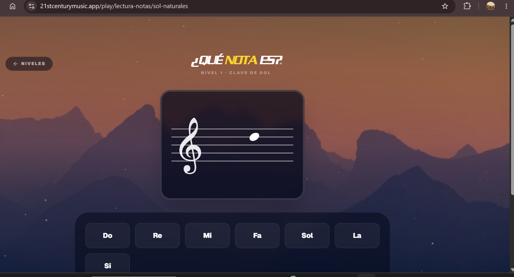
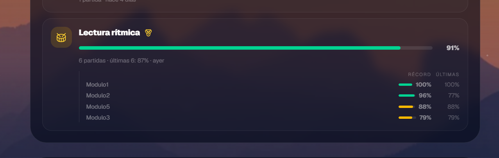
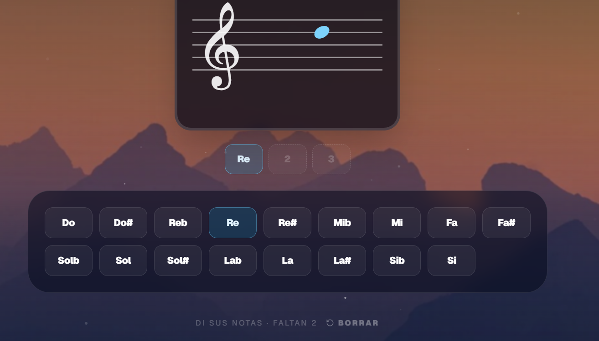

- el muestrario un pelin mas claro , porque ahora está muy oscuro...  lo mismo para el alumnario

y esto lo quitas "Escribe un nombre para empezar."  es obvio y queda "dumb"

- intenta quitar el espacio sin usar de la parte superior de las pages , de los juegos : 

y añade un pelin apenas de padding . basicamente cosniste, creo, en reducir el padding

- cuando acabas partida , el container se hace mas grande porque se cargan o renderizan  : ver progreso, y dias seguidos 
eso es muy incomodo para el usuario y puede hacerle clickar donde no quiere (pon un skeleton o algo, pero eso no es admisible ) :  

- quizas, que los porcentajes (no de cada juego , sino de cada modo) sean no una media sino un total : 
por ejemplo si tienes SOLAMENTE UNO HECHO, no tiene sentido que tengas 100% directamente...no ? o que opinas ? sino que por 

ejemplo si hay 5 submodos  :pues si tienes 100% en solo uno y 0 en resto pues : 1/5 = 20% . o que ? 

auqneu al mismo tiempo igual queda mal. o que opinas ? 

- oye , me acabo de dar cuenta de que aqui hay deamsiadas notas...reamente tiene sentido que estén repetidas los sostenidos , usando bemol tambien ? eso lía más que aprender...o me equivoco 
que piensas ? 

por lo menos ocurre esta situacion en acordes-pentagrama/escribir , y no sé si en más sitios

- buff un tema que me estoy dando cuenta : armaduras está mucho mas bright  (brillante) que los otros modos...y no si ocurre con otros .. y la verdad : mola más , que esté asi de brillante...lo otro es muy oscuro....si alguien quiere oscura que lo elija ... jajajaja 

que piensas ? hablemos 